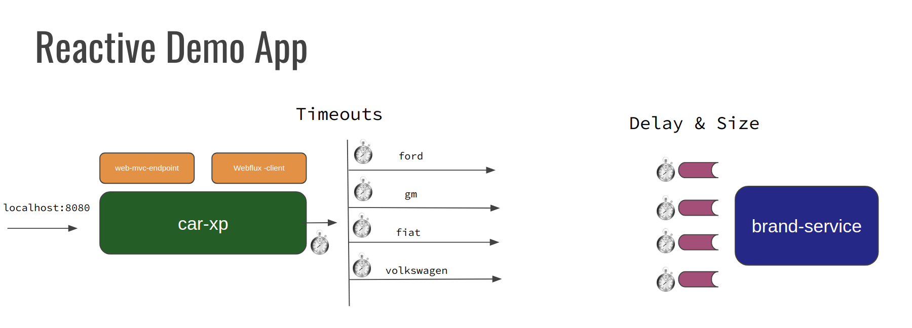

# Reactive Playground Spring Web MVC and Webflux

Playground to test and observe behaviour os spring webflux applications used alone and in combination
with spring web mvc applications. The main goal is to simulate real case scenarios when introducing
spring webflux in parallel with existing spring web-mvc applications.

## Demo App

The initial demo app is composed of 2 springboot applications.

- car-xp - entry point application which receives the request in a spring-web-mvc endpoint and
uses a reactive client and makes 4 parallel calls to back end services.

- brand-service - emulates the back end 'blocking' service and implement 4 endpoints which can be properly 
configured to block for specified amounts of time and return different volumes of payloads of data.

This project has been created with multiple branches in a way that each branch represents / implements a specific 
scenarios. More branches can / will be added with time.

To overall idea of the playground is represented below: 

A GET call on the car-xp service will trigger an endpoint which will start a reactive client that blocks
waiting for the response from multiple parallel service calls made by a reactive client. 

Timeouts for the parent call and for each parallel call from the client size can be configured in the 
car-xp [application properties](./car-xp/src/main/resources/application.yml) yml file.

On the brand-service each call ends up in one endpoint (which is blocking in the original version on the master branch) 
where configuration can be done to implement a synchronous block delay and the number of entries in the response can be 
configured as a [property](./brand-service/src/main/resources/application.yml). 

## Quick run

Check it out: `git clone git@github.com:mmaia/reactive-palyground-webflux.git` (feel free to fork and send Merge Requests)

They're springboot applications so you can run them from your IDE or command line. 
I have covered this in this other [post](https://dev.to/thegroo/spring-boot-crash-course-21nm). 

`mvn spring-boot:run`

With the applications running, navigate to localhost:8080 to call the xp endpoint which will triggered the weblflux 
blocking calls.

Multiple different versions of the configuration between these two services are available in each branch of this repo. 

## Tools

We recommend that you use the available free tools to watch the behaviour of the different scenarios implementations closely.
I tend to use the following free tools. 

1. Load - In case I want to put some parallel calls and multiple calls I tend to use one of these: 
[Apache Benchmark](https://httpd.apache.org/docs/2.4/programs/ab.html), 
[JMeter](https://jmeter.apache.org/) or [Locust](https://locust.io/).

2. Visualize - In most cases I usually start using [jconsole](https://docs.oracle.com/javase/7/docs/technotes/guides/management/jconsole.html) 
or [Mission Control](https://www.oracle.com/java/technologies/jdk-mission-control.html) both give you access to 
thread stacks and JMX, for memory analysis [Eclipse MAT](https://www.eclipse.org/mat/).  

